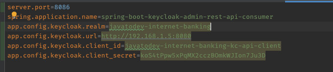
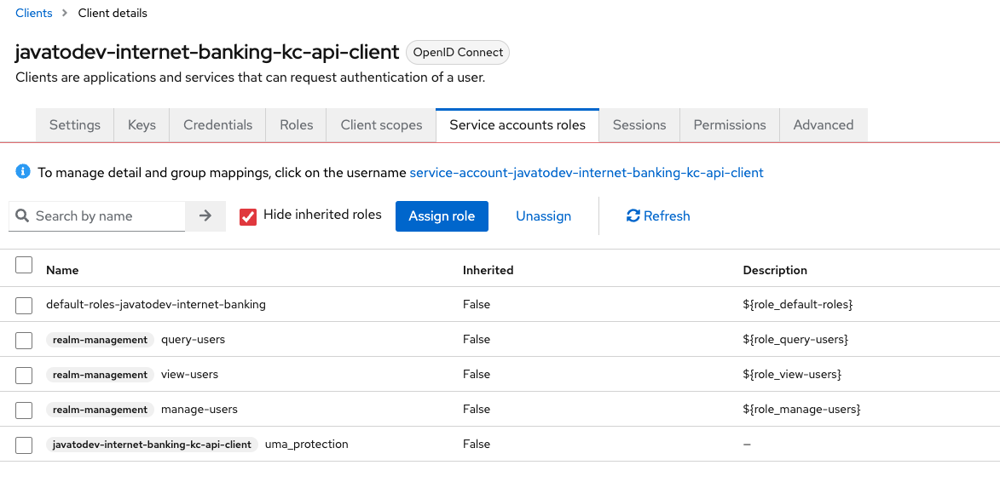
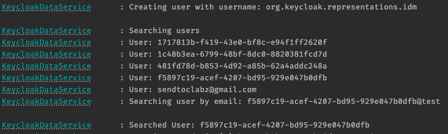

## KEYCLOAK ADMIN API CONSUMER - SPRING BOOT

This project is a simple example of how to consume the Keycloak Admin API using Spring Boot.

### Requirements
- Java 21
- Gradle
- Keycloak Server
- Keycloak Admin API Client

### How to run

1. Clone the project
2. Run the Keycloak Server
3. Create a new client in the Keycloak Admin Console
4. Update the `application.properties` file with the client credentials

5. Run the project

### Client Service Account Roles

For this test application I've only enabled following roles for this client. Feel free to enable any other roles as per your requirement.

### Screenshots

